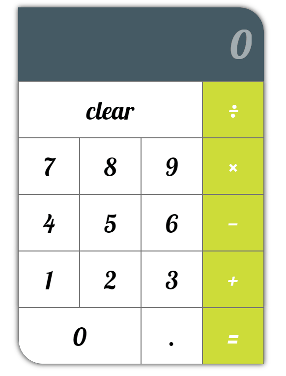

### React Calculator

A simple calculator that supports addition, subtraction, division, and multiplication.  

I decided to build this after reading an [article](https://daveceddia.com/react-practice-projects/) about some fun React projects to build. I came up with the cool color scheme through this [pallete generator](https://materialpalette.com). I think it came out pretty well. Let me know what you think: [@Joshster_](https://twitter.com/Joshster_)

## Gif

This project was bootstrapped with [Create React App](https://github.com/facebook/create-react-app).

## Available Scripts

In the project directory, you can run:

### `npm start`

Runs the app in the development mode. 
Open [http://localhost:3000](http://localhost:3000) to view it in the browser.
